# 3D Model Generator

  <h3><em>⚡ A Next.js 14+ TypeScript Project Powered by Tailwind, PNPM & Modular Architecture</em></h3>

  <!-- Tech Stack Badges -->
  <p>


  </p>

> Here's a quick look at the interface and layout of the **3D Model Generator** app.

<!-- Horizontal Screenshot -->
<p align="center">
  
</p>

<!-- Two Square/Vertical Screenshots Side by Side -->
<p align="center">
  
  
</p>

> _All screenshots can be relocated in the `./screenshots/` directory. Adjust filenames and folder name or paths as per your project structure._


  <p>
    <a href="#📦-folder-structure">Folder Structure</a> •
    <a href="#🧠-architecture">Architecture</a> •
    <a href="#📊-flow-diagrams">Flow Diagrams</a> •
    <a href="#🚀-setup--installation">Setup</a> •
    <a href="#✨-features">Features</a> •
    <a href="#📄-license">License</a>
  </p>
</div>

---

## 📦 Folder Structure

| Folder / File         | Description                                                                 |
|-----------------------|-----------------------------------------------------------------------------|
| `app/`                | App router directory (Next.js 14+ App Router features).                     |
| `components/`         | Shared, reusable React components (UI widgets, layout wrappers, etc).       |
| `hooks/`              | Custom React hooks for shared logic and state.                              |
| `lib/`                | Utility functions, API clients, and core logic helpers.                     |
| `public/`             | Static assets like images, icons, fonts, etc.                              |
| `styles/`             | Global CSS, Tailwind extensions, and theme configurations.                  |
| `next.config.mjs`     | Next.js project configuration in ESM format.                                |
| `tailwind.config.ts`  | Tailwind CSS configuration with theme extensions.                           |
| `tsconfig.json`       | TypeScript compiler configuration.                                          |
| `package.json`        | Project dependencies and scripts.                                           |
| `pnpm-lock.yaml`      | Lockfile for reproducible installs (PNPM).                                  |

---

## 🧠 Architecture

```mermaid

flowchart TD
  User["👤 User"]
  Browser["🌐 Browser"]
  App["💻 Next.js Frontend"]
  Router["🧭 App Router (14+)"]
  Components["🧩 Shared Components"]
  Hooks["🔁 Custom Hooks"]
  Lib["📚 Utilities & Services"]
  Tailwind["🎨 Tailwind CSS"]
  Public["🖼️ Assets"]
  Config["⚙️ Config Files"]

  User --> Browser
  Browser --> App
  App --> Router
  App --> Components
  App --> Hooks
  App --> Lib
  App --> Tailwind
  App --> Public
  App --> Config

```



---

## 📊 Flow Diagrams

### 🌀 Request-Response Lifecycle (Frontend-Only)

```mermaid
sequenceDiagram
  participant U as 👤 User
  participant B as 🌐 Browser
  participant A as 💻 App Router
  participant C as 🧩 Component Tree
  participant H as 🔁 Hooks
  participant S as 📚 Service Layer
  participant T as 🎨 Tailwind Styles

  U->>B: Load Page
  B->>A: Route Request
  A->>C: Render Components
  C->>H: Call Custom Hooks
  H->>S: Fetch/Compute Data
  C->>T: Apply Tailwind CSS
  C-->>U: UI Rendered
```



---

## 🚀 Setup & Installation


### 1. Clone the repository
```bash
git clone https://github.com/Arknight007/Neural-Synthesis-.git
cd ProjectName
```

### 2. Install dependencies using PNPM
```bash
pnpm install
```

### 3. Run the development server
```bash
pnpm dev
```

> Make sure you have `PNPM` installed globally:
```bash
npm install -g pnpm
```

---

## ✨ Features

- ⚙️ **App Router (Next.js 14+)** — Page-based routing with dynamic segments.
- 🔁 **Custom Hooks** — Reusable stateful logic across the app.
- 🎨 **Tailwind CSS** — Utility-first styling for rapid UI development.
- 🧩 **Component-Driven** — Reusable, composable, testable React components.
- 📚 **Modular Architecture** — Clear separation of concerns via folders like `lib`, `hooks`, and `styles`.
- 🛠️ **TypeScript Support** — Strongly-typed codebase for better DX and reliability.
- 🧼 **Linting + Prettier** — Enforced code standards for collaboration.
- 🚀 **PNPM Monorepo Ready** — Fast installs and workspace support.

---

## 📄 License

This project is licensed under the [MIT License](LICENSE).

---

<div align="center">
  <p>Created with ❤️ by <a href="https://github.com/Arknight007" target="_blank"><strong>Srikar (Arknight007)</strong></a></p>
  <p>If this project helped you, consider giving it a ⭐ on GitHub!</p>
</div>
